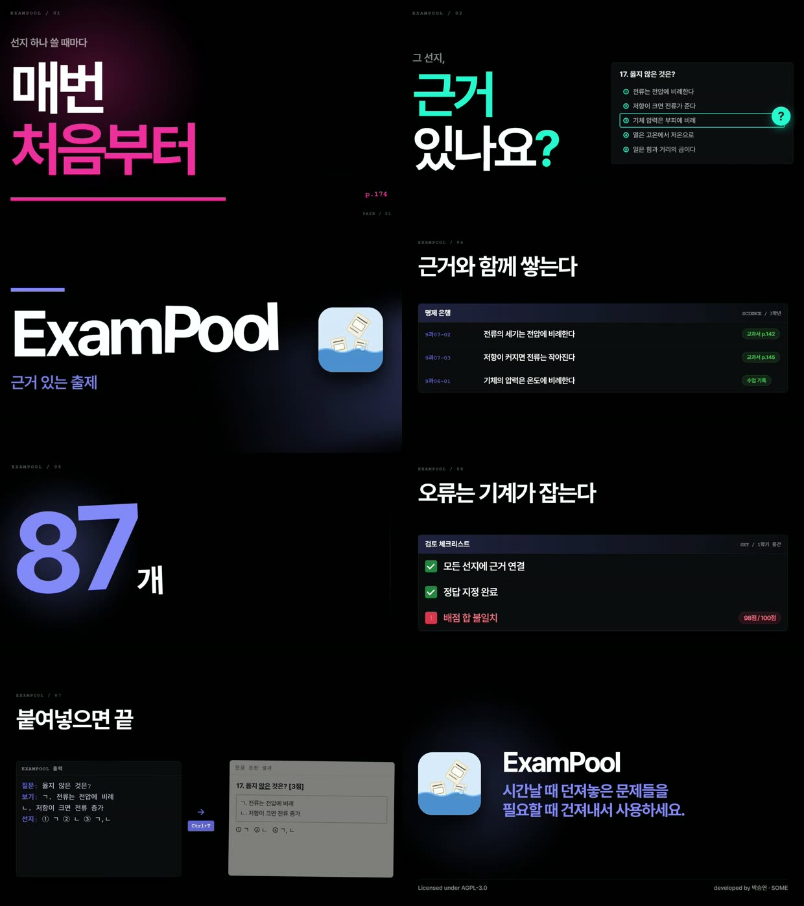

# ExamPool 홍보 영상

`out/exampool-promo.mp4` — 1920×1080 · 30fps · 28.4초 · 배경음악 + 효과음 포함



---

## 만드는 방법

렌더러는 [ReelForge](https://github.com/kimsh-1/reelforge)(Apache-2.0)를 쓴다.
GSAP 타임라인을 **일시정지 상태로 두고 프레임을 하나씩 seek 하며 캡처**하므로,
같은 입력이면 항상 같은 픽셀이 나온다.

### 사전 준비

로컬에 ReelForge 체크아웃이 필요하다 (이 저장소에는 포함하지 않는다).

```bash
git clone https://github.com/kimsh-1/reelforge.git
cd reelforge && npm ci
```

> **Windows 주의 3가지** (실제로 겪은 것)
> 1. 경로가 길면 체크아웃이 깨진다 → 짧은 경로에 클론할 것
> 2. `core.autocrlf=true`가 벤더 GSAP 파일을 CRLF로 바꿔 무결성 해시가 어긋난다
>    → `git config core.autocrlf false` 후 `vendor/` 재체크아웃
> 3. ReelForge가 `node_modules/.bin/hyperframes`(유닉스 shim)를 spawn 해서 ENOENT가 난다
>    → `src/compiler/render-lint.mjs`, `src/pipeline/core/steps.mjs` 에서
>       `node node_modules/hyperframes/dist/cli.js` 로 직접 호출하도록 고칠 것

### 렌더

```bash
# 1) 컴파일 (씬 HTML → 렌더 가능한 컴포지션)
node bin/vf compile <이 폴더 경로> --preset fixtures/presets/dark-hype.json

# 2) 렌더 (약 15~20분, 워커 1개 권장 — 메모리 부족 시 Chrome 워커가 죽는다)
node node_modules/hyperframes/dist/cli.js render <이 폴더>/build \
  --output <이 폴더>/out/silent.mp4 \
  --fps=30 --quality=standard --workers=1 --no-browser-gpu

# 3) 오디오 합성
ffmpeg -i out/silent.mp4 -i sfx/final-audio.wav -map 0:v:0 -map 1:a:0 \
  -c:v copy -c:a aac -b:a 192k -shortest -movflags +faststart -y out/exampool-promo.mp4
```

전체 렌더 전에 **스냅샷으로 먼저 확인**하면 20분을 아낀다.

```bash
node node_modules/hyperframes/dist/cli.js snapshot <이 폴더>/build \
  --output snaps --at 1.2,5.4,9.6,13,16,20,23,27 --no-end --describe false
```

---

## 구조

| 파일 | 역할 |
|------|------|
| `scene_specs.json` | 씬 목록·순서·전환·무드(장면별 강조색을 결정) |
| `scenes-src/sNN-free.html` | **씬 본체.** 디자인·문구·애니메이션이 전부 여기 있다 |
| `audio_meta.json` | 장면 길이. 110BPM 비트에 맞춰 **직접 작성**했다 |
| `direction/pilot.json` | ReelForge 파일럿 게이트 통과 기록 |
| `out/` | 결과물 (영상·포스터·컨택트시트) |

`build/`, `sfx/`, `assets/audio/` 는 재생성되므로 추적하지 않는다.

---

## 음악에 맞춘 방식

배경음악은 **110 BPM**(비트 0.5455초, 1마디 2.182초).
곡의 **9.265초 지점(다운비트)** 부터 사용해서, 영상 8.7초에 음악이 풀 에너지로
바뀌는 순간이 **ExamPool 브랜드 등장**과 겹치게 했다.

장면 길이는 전부 비트의 정수배다.

| 씬 | 내용 | 비트 | 시작 |
|----|------|------|------|
| s01 | 매번 / 처음부터 (교과서 페이지 넘김) | 8 | 0.00 |
| s02 | 근거 있나요? (문항 카드 + ? 배지) | 8 | 4.36 |
| s03 | **ExamPool** + 아이콘 | 4 | 8.73 |
| s04 | 명제 은행 | 8 | 10.91 |
| s05 | 87개 | 4 | 15.27 |
| s06 | 검토 체크리스트 | 8 | 17.46 |
| s07 | 붙여넣으면 끝 | 4 | 21.82 |
| s08 | 아이콘 · 슬로건 · 푸터 | 8 | 24.00 |

씬 안의 글자 등장도 비트/반비트 위에 올려두었다. **길이를 바꾸면 싱크가 깨진다** —
문구만 고칠 때는 `scenes-src/`의 텍스트만 건드리고 타이밍 숫자는 두는 게 안전하다.

---

## 자산 라이선스

- **배경음악**: Pixabay(SigmaMusicArt) — 상업 이용 가능, 크레딧 표기 불필요.
  다만 **원본 mp3를 재배포하는 것은 금지**라 저장소에 넣지 않는다(`.gitignore`).
  영상 안에 인코딩된 것은 문제없다.
- **효과음**: ffmpeg로 직접 합성 (저작권 없음). 합성 파라미터는 커밋 이력 참고.
- **폰트**: Pretendard (OFL) — ReelForge 프리셋이 번들.

---

## 앞으로

실제 프로그램 화면 녹화가 준비되면, **s04 · s06 · s07의 목업 패널 자리**에
ffmpeg 오버레이로 얹으면 된다. 씬 시작 시각이 고정되어 있어 비트는 유지된다.

```bash
ffmpeg -i out/exampool-promo.mp4 -i screen.mp4 -filter_complex \
  "[1:v]scale=1450:-1,setpts=PTS-STARTPTS+10.9/TB[ov];\
   [0:v][ov]overlay=x=77:y=380:enable='between(t,10.9,15.3)'" out/v2.mp4
```
